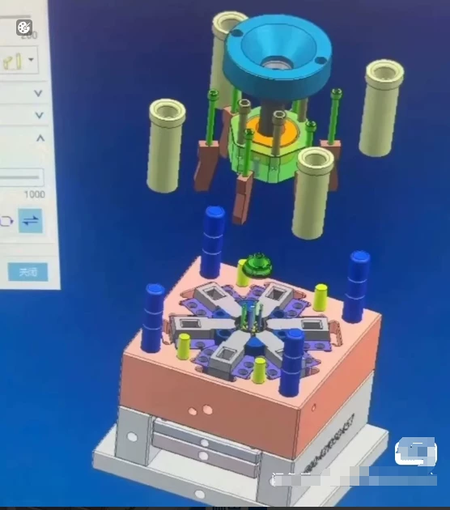

# 360 Cases of Mold Simulation - Rare Resource - Professional Simulation Cases. Features: 1. Complex internal structure, requiring high-precision simulation models. 2. Involvement of various materials and processes, requiring comprehensive consideration of various factors. 3. Requires professional simulation software and tools. 4. The results have high reference value, providing strong support for product design and improvement.

## Body

Case Study 360: Die Simulation
Rare Resources, Professional Simulation Cases
Features: 1. Interior

360 mold simulation cases - scarce resources - professional simulation cases - features: 1.

Case Study 360: Die Simulation
Rare Resources: Professional Simulation Cases
Features: 1. Rich content,
Clearly categorized.
2. Suitable for learning and reference in die design.
3. Each case includes a complete simulation analysis.

4. It can be used directly, just grab it and use it.
Sending it via Baidu NetEase Cloud.
If you're interested, click "I want to buy" to chat with me privately!

## Images

## Payment

Here is a pay link on Stripe ( https://buy.stripe.com/3cs8yP7sY87d0vu9AB ). Please contact me lonlonago@foxmail.com after funding $89, and I will send you a complete data files , thank you!

